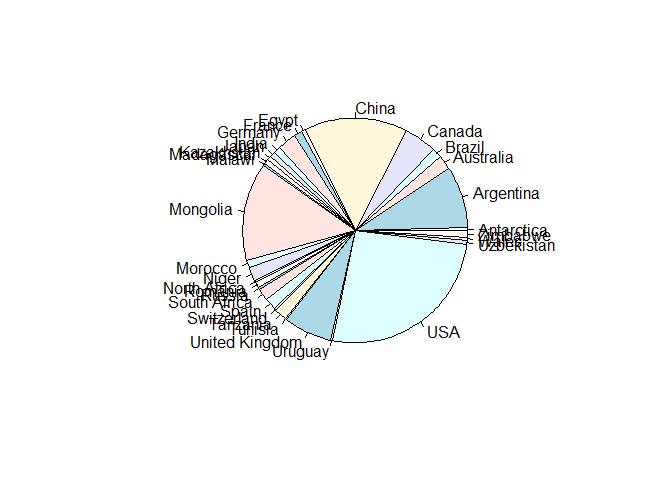
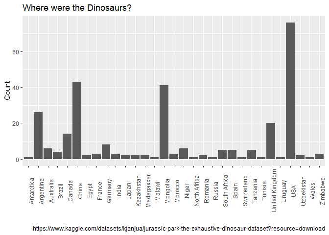
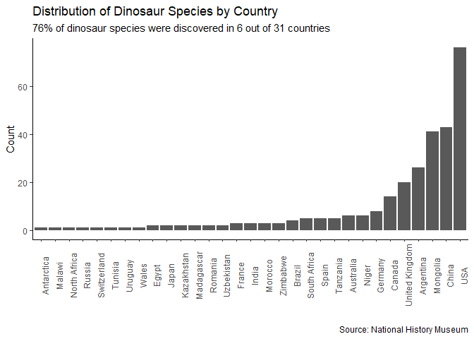
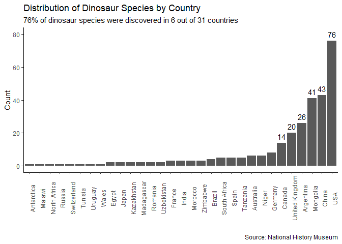

R Notebook
================

This is an [R Markdown](http://rmarkdown.rstudio.com) Notebook. When you
execute code within the notebook, the results appear beneath the code.

Try executing this chunk by clicking the *Run* button within the chunk
or by placing your cursor inside it and pressing *Cmd+Shift+Enter*.

``` r
# Plotting dinosaur data
# uploading dataset and packages
  link="https://github.com/Data-Dumps/deliverable1/raw/main/dinodata.xlsx"
  library(rio) #note: Jose wants us to omit the install.packages line
```

    ## Warning: package 'rio' was built under R version 4.2.2

``` r
  dinodata=import(link)
    
    Dinocountry=table(dinodata$lived_in)
    prop.table(Dinocountry)
```

    ## 
    ##     Antarctica      Argentina      Australia         Brazil         Canada 
    ##    0.003436426    0.089347079    0.020618557    0.013745704    0.048109966 
    ##          China          Egypt         France        Germany          India 
    ##    0.147766323    0.006872852    0.010309278    0.027491409    0.010309278 
    ##          Japan     Kazakhstan     Madagascar         Malawi       Mongolia 
    ##    0.006872852    0.006872852    0.006872852    0.003436426    0.140893471 
    ##        Morocco          Niger   North Africa        Romania         Russia 
    ##    0.010309278    0.020618557    0.003436426    0.006872852    0.003436426 
    ##   South Africa          Spain    Switzerland       Tanzania        Tunisia 
    ##    0.017182131    0.017182131    0.003436426    0.017182131    0.003436426 
    ## United Kingdom        Uruguay            USA     Uzbekistan          Wales 
    ##    0.068728522    0.003436426    0.261168385    0.006872852    0.003436426 
    ##       Zimbabwe 
    ##    0.010309278

``` r
    propT=prop.table(Dinocountry)*100
    pie(Dinocountry)
    (tableFreq=as.data.frame(Dinocountry))
```

    ##              Var1 Freq
    ## 1      Antarctica    1
    ## 2       Argentina   26
    ## 3       Australia    6
    ## 4          Brazil    4
    ## 5          Canada   14
    ## 6           China   43
    ## 7           Egypt    2
    ## 8          France    3
    ## 9         Germany    8
    ## 10          India    3
    ## 11          Japan    2
    ## 12     Kazakhstan    2
    ## 13     Madagascar    2
    ## 14         Malawi    1
    ## 15       Mongolia   41
    ## 16        Morocco    3
    ## 17          Niger    6
    ## 18   North Africa    1
    ## 19        Romania    2
    ## 20         Russia    1
    ## 21   South Africa    5
    ## 22          Spain    5
    ## 23    Switzerland    1
    ## 24       Tanzania    5
    ## 25        Tunisia    1
    ## 26 United Kingdom   20
    ## 27        Uruguay    1
    ## 28            USA   76
    ## 29     Uzbekistan    2
    ## 30          Wales    1
    ## 31       Zimbabwe    3

``` r
    names(tableFreq)=c("Country","Count")
    tableFreq$Percent=as.vector(Dinocountry)
    tableFreq
```

    ##           Country Count Percent
    ## 1      Antarctica     1       1
    ## 2       Argentina    26      26
    ## 3       Australia     6       6
    ## 4          Brazil     4       4
    ## 5          Canada    14      14
    ## 6           China    43      43
    ## 7           Egypt     2       2
    ## 8          France     3       3
    ## 9         Germany     8       8
    ## 10          India     3       3
    ## 11          Japan     2       2
    ## 12     Kazakhstan     2       2
    ## 13     Madagascar     2       2
    ## 14         Malawi     1       1
    ## 15       Mongolia    41      41
    ## 16        Morocco     3       3
    ## 17          Niger     6       6
    ## 18   North Africa     1       1
    ## 19        Romania     2       2
    ## 20         Russia     1       1
    ## 21   South Africa     5       5
    ## 22          Spain     5       5
    ## 23    Switzerland     1       1
    ## 24       Tanzania     5       5
    ## 25        Tunisia     1       1
    ## 26 United Kingdom    20      20
    ## 27        Uruguay     1       1
    ## 28            USA    76      76
    ## 29     Uzbekistan     2       2
    ## 30          Wales     1       1
    ## 31       Zimbabwe     3       3

``` r
    library(ggplot2)
```

    ## Warning: package 'ggplot2' was built under R version 4.2.2

<!-- -->

``` r
    base= ggplot(data=tableFreq,
                 aes(x=Country,
                   y=Count)) 
    plot1=base+geom_bar(stat='identity')+theme(axis.text.x = element_text(angle = 90))
    titleText='Where were the Dinosaurs?'
    plot2=plot1 + labs(title=titleText, x="", caption = "https://www.kaggle.com/datasets/kjanjua/jurassic-park-the-exhaustive-dinosaur-dataset?resource=download")
    plot2
```

<!-- -->

``` r
# sorting dinosaur counts least to greatest
    tableFreqSorted=tableFreq[order(tableFreq$Percent),]
    tableFreqSorted
```

    ##           Country Count Percent
    ## 1      Antarctica     1       1
    ## 14         Malawi     1       1
    ## 18   North Africa     1       1
    ## 20         Russia     1       1
    ## 23    Switzerland     1       1
    ## 25        Tunisia     1       1
    ## 27        Uruguay     1       1
    ## 30          Wales     1       1
    ## 7           Egypt     2       2
    ## 11          Japan     2       2
    ## 12     Kazakhstan     2       2
    ## 13     Madagascar     2       2
    ## 19        Romania     2       2
    ## 29     Uzbekistan     2       2
    ## 8          France     3       3
    ## 10          India     3       3
    ## 16        Morocco     3       3
    ## 31       Zimbabwe     3       3
    ## 4          Brazil     4       4
    ## 21   South Africa     5       5
    ## 22          Spain     5       5
    ## 24       Tanzania     5       5
    ## 3       Australia     6       6
    ## 17          Niger     6       6
    ## 9         Germany     8       8
    ## 5          Canada    14      14
    ## 26 United Kingdom    20      20
    ## 2       Argentina    26      26
    ## 15       Mongolia    41      41
    ## 6           China    43      43
    ## 28            USA    76      76

``` r
    (localesOrd=tableFreq[order(tableFreq$Percent),'Country'])
```

    ##  [1] Antarctica     Malawi         North Africa   Russia         Switzerland   
    ##  [6] Tunisia        Uruguay        Wales          Egypt          Japan         
    ## [11] Kazakhstan     Madagascar     Romania        Uzbekistan     France        
    ## [16] India          Morocco        Zimbabwe       Brazil         South Africa  
    ## [21] Spain          Tanzania       Australia      Niger          Germany       
    ## [26] Canada         United Kingdom Argentina      Mongolia       China         
    ## [31] USA           
    ## 31 Levels: Antarctica Argentina Australia Brazil Canada China Egypt ... Zimbabwe

``` r
    library(ggplot2)
    LABELS=paste0(round(tableFreq$Percent,2), '%')
    base= ggplot(data=tableFreq,
                 aes(x=Country,
                     y=Count,
                     label = LABELS))
    base= base + scale_x_discrete(limits=localesOrd) 
    base= base + theme_classic()
    plot1=base+geom_bar(stat='identity')+theme(axis.text.x = element_text(angle = 90))
    titleText='Distribution of Dinosaur Species by Country'
    plot2=plot1 + labs(title=titleText,x="", caption = "Source: National History Museum", subtitle = "76% of dinosaur species were discovered in 6 out of 31 countries")
    plot2
```

<!-- -->

``` r
# labeling counts of dinos for top 6 countries
    
    plot3=plot2 + geom_text(aes(label=ifelse(Count>8,
                                      round(Count,2),"")),
                     nudge_y = 4)
            
    plot3
```

<!-- -->

Add a new chunk by clicking the *Insert Chunk* button on the toolbar or
by pressing *Cmd+Option+I*.

When you save the notebook, an HTML file containing the code and output
will be saved alongside it (click the *Preview* button or press
*Cmd+Shift+K* to preview the HTML file).

The preview shows you a rendered HTML copy of the contents of the
editor. Consequently, unlike *Knit*, *Preview* does not run any R code
chunks. Instead, the output of the chunk when it was last run in the
editor is displayed.
